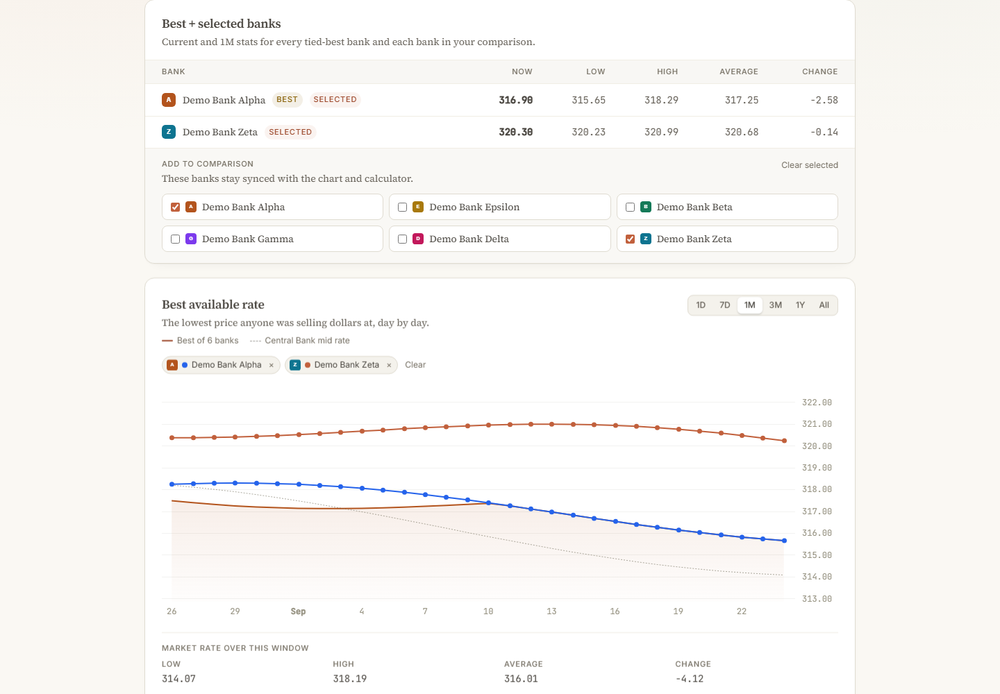
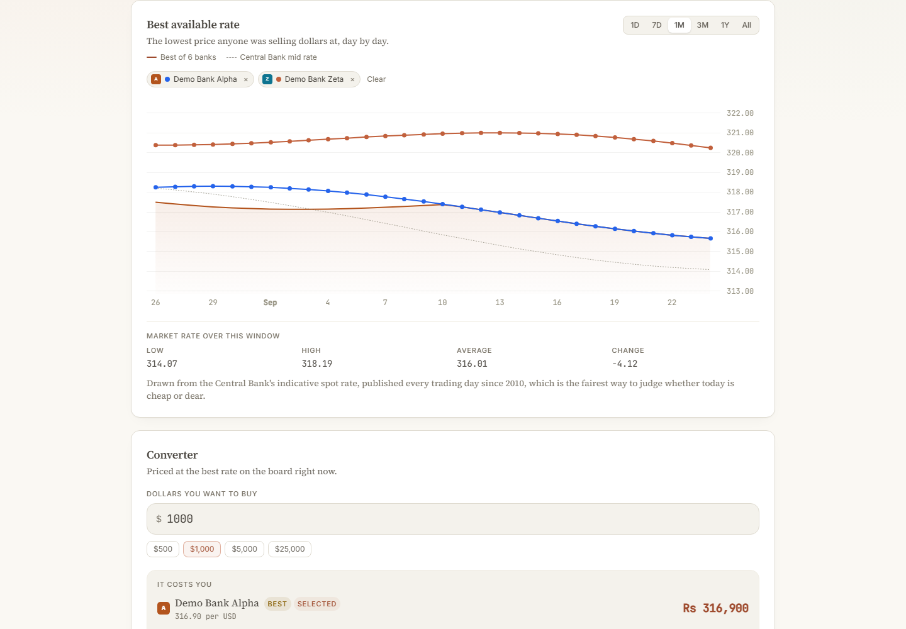

# fxtrack

[](https://github.com/anjulalk/fxtrack/actions/workflows/ci.yml)
[](https://github.com/anjulalk/fxtrack/releases/latest)
[](https://github.com/anjulalk/fxtrack/actions/workflows/deploy.yml)
[](https://nodejs.org/)
[](LICENSE)

**fxtrack** is an independent USD/LKR bank-rate tracker for Sri Lanka, built by [Anjula Karunarathne](https://anjula.dev).

It compares published buying and selling rates from Sri Lankan banks, keeps historical snapshots, and presents the results in a focused interface. Rates are sourced from official bank and Central Bank of Sri Lanka pages.

## Screenshots

> The screenshots below are deterministic demo captures. All bank names, rates, timestamps, and history points are synthetic; they are not live bank or Central Bank data.





## Development

```bash
npm install
npm run dev
```

## Design system

The interface follows the same design system as [anjula.dev](https://anjula.dev): paper surfaces,
ink text, one clay accent, Inter for chrome and Source Serif 4 for prose. The page carries the shared
ambient wash (two soft clay and moss glows, `--wash-ambient`), and the wordmark is two tones, `fx` in
ink and `track` in clay. The tokens are published at <https://anjula.dev/design/tokens.css> and
documented in that project's `DESIGN.md`; this app mirrors them in `packages/web/src/style.css`.

## Deploy

The site is served from the repo root on a custom subdomain (`BASE_PATH=/`); the default
`/fxtrack/` base keeps the GitHub project-pages path working until the domain is attached.

```bash
BASE_PATH=/ SITE_URL=https://fxtrack.anjula.dev npm run build
```

`SITE_URL` only affects the generated `sitemap.xml`; the canonical and social tags in
`packages/web/index.html` carry the same origin and must be changed together.

## Releases

The live site deploys from `main`. Merge a pull request labeled `release:patch`, `release:minor` or `release:major` to update `VERSION`, create a Git tag and publish a GitHub release. You can also dispatch the `release.yml` workflow with a version bump.

## Attribution

Built by [Anjula Karunarathne](https://anjula.dev).

Bank names, logos, and marks belong to their respective owners and are used only to identify rate sources. Published rates are indicative. Confirm the applicable rate and fees with the bank before transacting.
